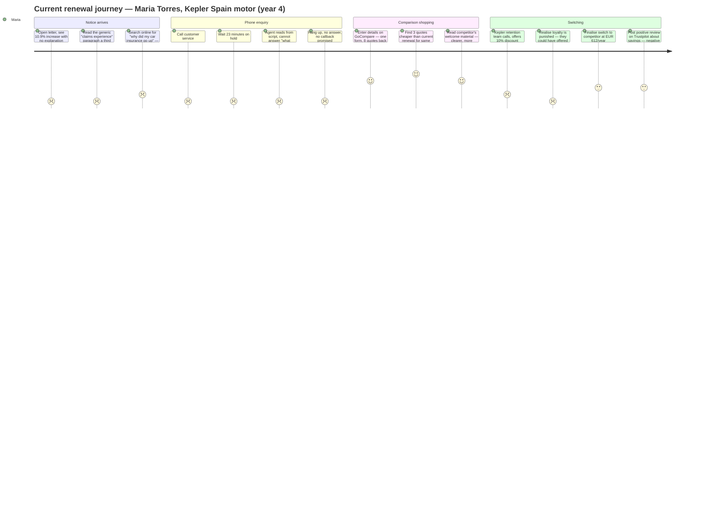

# Personas & Journey — Personalised Policy Communication Engine

**product:** Kepler Insurance
**feature:** Personalised Policy Communication Engine
**date:** 2026-06-18
**scope:** Current-state journey (before feature deployment) — illustrating the unmet needs the feature must solve.

---

## Persona 1: Sarah Chen — Renewal Communications Manager

| Dimension | Detail |
|---|---|
| **Role** | Renewal Communications Manager, Kepler Insurance UK (oversees 5 markets across Europe) |
| **Goal** | Produce renewal notices that satisfy 5 different market regulators while measurably reducing churn — without expanding her team of 3 |
| **Friction** | The legacy template system merges exactly 3 static fields (name, premium, due date). Any attempt at personalised causation language requires manual editing per policy — impossible at 500K policy scale. Each market has different regulatory template rules (FCA requires plain language; BaFin requires formal pricing breakdown format) — her team maintains 5 separate Word document templates and copy-pastes data weekly. The batch print cycle runs Monday morning; any change after Friday COB misses the window. |
| **Current workaround** | She manually spot-checks ~2% of each batch before dispatch, looking for obvious errors (wrong premium, wrong name). The remaining 98% go out unchecked. She has built a fragile Excel macro that highlights policies where the premium delta exceeds 30% — but it can't explain *why*, so she can't even flag those for review with context. She submits monthly churn reports to the CRO but cannot connect any single renewal notice to a subsequent churn event — she has no data on *which* notices drive switching. |

---

## Persona 2: James Okafor — FCA Consumer Duty Compliance Officer

| Dimension | Detail |
|---|---|
| **Role** | Senior Compliance Officer, Kepler Insurance — leads FCA Consumer Duty fair-value evidence programme |
| **Goal** | Demonstrate to the FCA (and eventually BaFin, ACPR, IVASS, DGSFP) that every renewal premium across all 5 markets represents fair value for that specific policyholder, with an auditable evidence chain |
| **Friction** | The legacy PAS stores only the final premium and 4 high-level modifiers (NCD, introductory discount, claims surcharge, region loading). Reconstructing the full rating decision for a single policy requires tracing through 3 different batch actuarial systems — a 2-hour manual effort per policy. For 500K renewals/year, that's 1M person-hours annually. DORA (in force Jan 2025) requires ICT incident reporting within 24 hours and resilience testing during transitions — the migration cutover windows are a continuous compliance exposure. FCA Consumer Duty demands fair-value evidence per renewal; opaque pricing with no causation narrative is indefensible in a regulator review. |
| **Current workaround** | He samples 0.1% of renewals (500 policies/year) for manual deep-dive, documents those as "evidence of fair value outcomes." For the remaining 99.9%, he relies on the original rate filing approval as a proxy — a method the FCA has signalled it will consider inadequate in its next thematic review. He has built a relationship with the pricing actuary who manually runs batch extracts for each regulator request — a process that takes 2 weeks per request and depends on one person's goodwill. He knows this is not sustainable but has no budget to instrument the legacy PAS. |

---

## Persona 3: Maria Torres — Policyholder (Customer)

| Dimension | Detail |
|---|---|
| **Role** | 34-year-old marketing manager, Barcelona. Has held motor insurance with Kepler Spain (DGSFP-regulated) for 4 years. Zero claims. Pays EUR 680/year. |
| **Goal** | Understand why her premium went up (again) and feel she's being treated fairly — or switch to someone who treats her fairly |
| **Friction** | The renewal letter arrives: "Your new premium is EUR 754 — an increase of 10.9%." No explanation of why. No breakdown of what drives the increase. No comparison to similar policyholders. The letter includes a paragraph that reads "this increase reflects changes in claims experience and operating costs in your region" — she has seen this exact wording for 3 years running. It says nothing specific to her: her 4-year claims-free record, her safe-driver profile, her neighbourhood's claim trends. She feels the insurer is hiding something. Genuine concern: "If they can't explain *why* it went up, how do I know they're not just making up a number?" |
| **Current workaround** | She calls customer service. 23-minute hold. The agent reads from a script ("premiums are reviewed annually based on a number of factors including claims experience, inflation, and operating costs"). She asks "what changed for *me* specifically?" The agent cannot answer. She hangs up, frustrated. She spends 15 minutes on GoCompare entering her details. Three cheaper quotes appear. She switches to one (EUR 612, equivalent coverage). She saves EUR 142/year. She feels satisfaction at outsmarting the system — and resentment that the original insurer didn't offer her a fair price first. She tells two friends to switch too. |

---

## Current-State Journey Map

The renewal experience for Maria Torres — a 34-year-old, 4-year claims-free policyholder. Showing the current process that drives switching.

**Scores:** 1–5 (1 = very painful, 5 = very satisfying). The journey averages ~1.5 across the first half (notice + phone enquiry — every step is painful) and peaks at 4–5 during comparison shopping (the competitor interfaces are easy, the savings are real). The retention call is a late-stage 2 — the offer proves the original price was inflated, confirming the "loyalty is punished" thesis from 02-primary-signal.md.

---

## Top 3 Unmet Needs

### 1. Causal premium decomposition — the system cannot explain what drives any specific premium change

**Pain point:** No component-level visibility into premium pricing. The legacy PAS stores only the final premium. Neither the renewal communications team, the compliance officer, nor the customer service agent can determine *why* a specific policy's premium changed by a specific amount.

**Current state:** Zero visibility. Customer service agents read from scripts. Compliance samples 0.1%. The communications team sends opaque letters and hopes for the best.

**This feature must solve:** Phase 0 data readiness — instrument the rating engine to expose every input variable consumed at score time per policy, enabling causal attribution per renewal. Without this, personalised communication is impossible.

### 2. Per-policy fair-value evidence chain — no auditable link between price and justification

**Pain point:** FCA Consumer Duty requires fair-value evidence per renewal. DORA requires auditable resilience during system transitions. Current systems cannot produce either at policy-level granularity. The sampling approach (0.1% manual review) is not defensible in a regulator inspection.

**Current state:** The compliance officer relies on the original rate filing as a proxy for 99.9% of policies — a method the FCA has flagged as inadequate. Each regulator data request takes 2 weeks and depends on one person's manual effort.

**This feature must solve:** The personalised notice *is* the evidence chain. A renewal letter that states "your premium increased 4% because repair costs in Barcelona rose 7% and your claims-free status places you in our best-risk tier" simultaneously serves the customer (transparency) and the regulator (evidence of fair-value consideration). The compliance guardrail engine that validates each notice before dispatch also produces the audit trail.

### 3. Switching-intent signal detection — no ability to know which notice triggers a switch

**Pain point:** The communications team sends 500K renewal letters and has no idea which ones drive switching. They cannot connect the content of a notice to a subsequent churn event. This means they cannot learn from churn patterns, cannot segment retention interventions, and cannot quantify the impact of notice quality on retention.

**Current state:** Monthly churn reports show aggregate rates per market. No policy-level correlation between notice content, premium delta magnitude, and switch probability. The team cannot distinguish "priced-out switches" (customer left because the rate was genuinely uncompetitive) from "opacity-driven switches" (customer left because they didn't understand the rate and assumed unfairness).

**This feature must solve:** The A/B test design (treatment vs control) is the minimum viable answer to this need — it isolates the effect of notice quality on switching. But in production, the system should log every notice's content, the policy's premium delta components, and the renewal outcome, enabling a learning loop that tunes causation language per segment (young drivers respond to different framing than long-tenure retirees).
