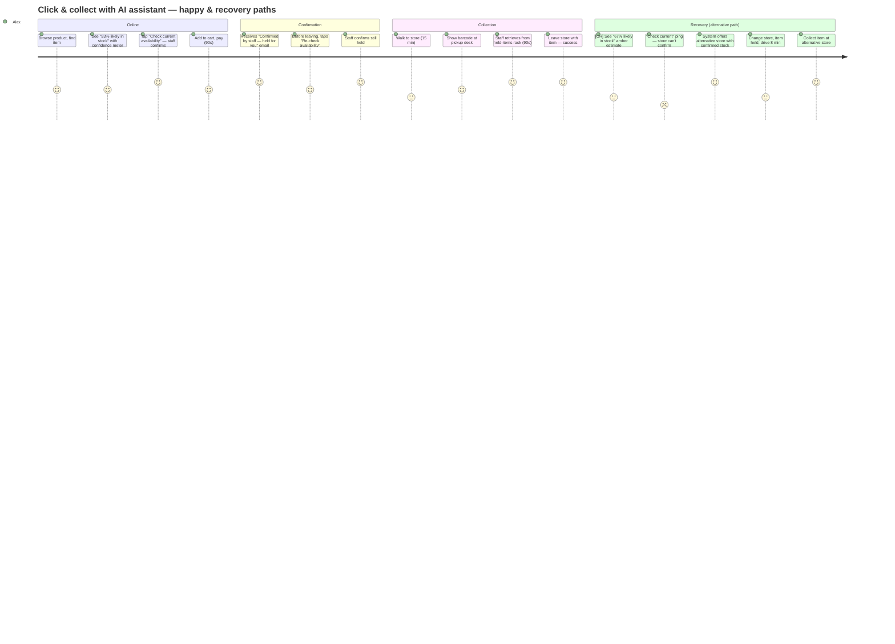

# Journey Map v2 — Click & Collect Phantom Stock (With AI Assistant)

**Product:** Meridian Retail Group
**Feature:** AI availability assistant (deployed — future-state journey)
**Date:** 2026-06-18
**Shopper persona:** Alex, 32, urban professional, uses click & collect 2–3×/month for household goods

---

## Journey Table — Happy Path (AI says high confidence, item collected)

| Step | Action | Emotion | Frustrations (up to 3) | Drop-off point? |
|---|---|---|---|---|
| **1. Product discovery** | Browses meridian.com on mobile, finds a smart lamp. Price is right (EUR 49). | 😐 Neutral — routine browsing. | None. | — |
| **2. AI availability estimate** | Sees "**93% likely in stock** at High Street (checked 4 min ago)" with a confidence meter (green bar, 3/4 segments filled). Taps it — expands to show: "Based on recent sales at this store and current stock data. Sold 8 units today." | 🙂 Positive — information is specific and feels trustworthy. "They can actually see how many they've sold today." | (1) "93%" feels precise but what does it mean operationally? (2) Estimate doesn't account for unprocessed returns that might add stock. | — |
| **3. "Check before you go" option** | A button: "**Check current availability**" — taps it. System sends a real-time ping to the store's handheld terminal. Staff confirms: "Yes, we have 2 in the back. I'll hold one for you." Alex gets a push notification: "**Item confirmed at High Street — held for 2 hours.**" | 😊 Delighted — "They checked for me. It's actually *held*." | None — confirmation is specific and actionable. | — |
| **4. Select store, add to cart, pay** | Store is pre-selected (recent store remembered). Adds to cart, checks out in 90 seconds. | 😊 Efficient — reorder velocity matches a power user. | (1) Holding period (2 hours) is short — if plans change, the hold might expire. | **Slight:** Could abandon if the hold period is too short for their schedule, but 2 hours covers most immediate pickups. |
| **5. Order confirmation** | Email: "Your item is ready for collection at High Street. Already checked and confirmed by staff. Show barcode to collect." | 😊 Positive — "Already confirmed by staff" removes the anxiety. | (1) Confirmation doesn't say *where* in the store to pick up. | — |
| **6. "Check freshness" option** | Before leaving, Alex checks the order page: a "**Re-check availability**" button shows "Stock last confirmed 38 min ago — tap to re-check." They tap it — system sends another ping to the store. Staff confirms still held. | 🙂 Positive — proactive option, even if not needed this time. "Good to know I can check before I leave." | None — feature exists but most shoppers won't need it. | — |
| **7. Travel to store** | Walks 15 minutes to High Street. Arrives at 18:10. | 😐 Neutral — routine walk. | None. | — |
| **8. Collection** | Goes to the click & collect desk. Shows barcode. Staff scans it, retrieves the lamp from the held-items rack (90 seconds). | 😊 Positive — seamless. The held-item bypasses the shelf entirely. "That was fast." | None — the held-item workflow eliminates the shelf-check failure mode. | — |
| **9. Post-collection feedback** | Meridian app asks: "Did you find everything? (Yes / Not quite)." Alex taps "Yes." | 🙂 Neutral — quick feedback loop. | (1) Survey appears immediately — could be delayed to next session for better UX. | — |
| **10. Post-journey** | Alex unpacks the lamp at home. Positive experience. "That click & collect actually worked — they held it for me." | 😊 Positive — trust in the channel is reinforced. | None. | — |

**Happy path satisfaction arc (with AI):**

```
Score
 5 |        🔍 (confirmed + held)       ✅ (collected)
 4 |  🛍️      🔮 (93%)          📦 📱 🚶 
 3 |                          🔄 (re-check)
 2 |
 1 |
   +----------------------------------->
    1   2   3   4   5   6   7   8   9  10
```

Arc is stable at 4–5 throughout — no steep drops because expectations were calibrated from step 2 and the item was physically confirmed at step 3.

---

## Journey Table — Recovery Path (AI says medium confidence, shopper avoids wasted trip)

This is the journey that matters: what happens when the AI assistant's estimate is *not* confident. This is where Meridian differentiates from every competitor assessed in the heuristic evaluation (none handle this path).

| Step | Action | Emotion | Frustrations | Drop-off? |
|---|---|---|---|---|
| **2a. AI estimate — medium confidence** | Sees "**67% likely in stock** at High Street (checked 12 min ago)" with an amber confidence meter (2/4 segments). Additional line: "This item sells fast — checked 3 times today and stock dropped from 18 to 4." | 😐 Cautious — the data is useful but the news isn't great. "It might be gone by the time I get there." | (1) 67% is ambiguous — heads or tails? (2) What should the shopper *do* with this information? | **⚠️ Potential drop-off** — shopper could abandon C&C here and choose delivery. This is an acceptable outcome (better than a wasted trip + cancellation). |
| **3a. "Check before you go" — stock not confirmed** | Alex taps "Check current availability." System pings the store. Staff responds: "We can't find it on the shelf — might be in the back. I can't confirm it right now." Push notification: "**High Street could not confirm availability. You can still try pickup, or choose home delivery instead.**" | 😐 Disappointed but informed — "At least they told me before I walked over." | (1) Item is wanted but store can't confirm — the system did its job but the physical reality is still the bottleneck. (2) "Could not confirm" leaves ambiguity — is it there or not? | — |
| **3b. Alternative offered** | Same notification: "**Alternative: Low Earth orbit store has 12 in stock (confirmed). 2.4 km away — 8 min drive.**" Also: "Or switch to home delivery — arrives tomorrow, free." | 😊 Positive — the system helps, rather than just reporting the problem. "The other store has 12 and it's confirmed? Let me just go there instead." | (1) Alternative store is further away — but the shopper made a conscious choice rather than discovering the problem at the shelf. | — |
| **4a. Re-routed to alternative store** | Alex changes the pickup store in the app to Low Earth orbit. Confirmation: "**Item held at Low Earth orbit. Ready in 30 min.**" | 😊 Positive — the system recovered from a potential failure. "This worked better than the old system would have." | None — the recovery path was smooth and transparent. | — |
| **5a–10a (happy path from alternative store)** | Repeat the happy path steps 4–10 from the alternative store. The item is confirmed and held, Alex drives there, collects it in 3 minutes at the pickup desk. | 😊 Positive — trust is maintained, even though the first choice store failed. | (1) Extra 8-minute drive vs the original 15-minute walk to High Street. (2) Net time is still less than a wasted trip + refund + re-order. | — |

**Recovery path satisfaction arc:**

```
Score
 5 |                              🚗 ✅
 4 |  🛍️          🏪 (alternative) 📦
 3 |      🔮 (67%)   🔄 (ping failed)   
 2 |
 1 |
   +----------------------------------->
    1   2a  3a  3b  4a  5a–10a
```

The arc dips at 3a (can't confirm) but recovers at 3b (alternative offered) and returns to 5 at collection. Compare this to the v1 current-state arc, which stayed at 1 from step 7 onward with no recovery path.

---

## Mermaid Journey Diagram — Combined (Happy + Recovery)



---

## Key Differences: v1 (Before) → v2 (With AI Assistant)

| Dimension | v1 — Current state | v2 — With AI assistant | Impact |
|---|---|---|---|
| **Availability signal** | Binary "In stock" — no timestamp, no caveat | Confidence estimate (93%) + timestamp + "checked X min ago" | Sets calibrated expectations upfront |
| **Inventory reservation** | None — item can sell between order and collection | Staff confirms via handheld ping; item held for 2 hours | Eliminates phantom stock for confirmed items |
| **Pre-trip check** | Not possible — shopper commits blindly | "Re-check availability" button on order page — pings store on demand | Shopper can verify before leaving |
| **Error recovery** | None — problem discovered at shelf, after wasted trip | Alternative store offered proactively; re-route in app | Captures orders that would otherwise cancel |
| **Post-collection feedback** | None — shopper leaves without providing data | "Did you find everything?" survey — feeds back into confidence model | Improves AI accuracy over time |
| **Drop-off at shelf** | ~70% of phantom incidents drop off at shelf or service desk | **Eliminated** — item is confirmed before shopper leaves home | Converts ~7% cancellation rate to near-zero for confirmed items |
| **Channel trust** | Eroded by repeated phantom stock | Reinforced by successful collections and proactive recovery | Long-term C&C adoption improves |

---

## What Didn't Change

| Aspect | v1 | v2 | Why unchanged |
|---|---|---|---|
| **SAP sync latency** | 15–30 min | 15–30 min | The AI assistant works *with* the latency, not against it — confidence estimates account for staleness |
| **Shopper still travels** | Yes | Yes | The core C&C value proposition (pick up on the way home) is unchanged |
| **Staff still involved** | Yes (at service desk, reactive) | Yes (on handheld, proactive) | Staff role shifts from "apologising" to "confirming" — but staff are still needed for the physical check |
| **No pricing change** | EUR 49 | EUR 49 | The AI assistant is a trust layer, not a pricing feature |

---

## v1 → v2 Changes Log

| Change | Why |
|---|---|
| Added "Check before you go" — real-time staff ping via handheld | Addresses H5 (error prevention) and H3 (user control) from heuristic evaluation. Gives the shopper a way to verify before committing to the trip. |
| Replaced binary "In stock" with confidence estimate + timestamp | Addresses H1 (visibility of system status). Every competitor fails at this. |
| Added inventory confirmation + 2-hour hold via staff workflow | Addresses the structural root cause of phantom stock (no reservation). Pragmatic workaround without an ERP change. |
| Added recovery path — alternative store offer when first choice fails | Addresses H9 (error recovery). No competitor proactively offers alternatives. |
| Added pre-trip re-check button on order page | Addresses H3 (user control) — shopper can re-verify before leaving. |
| Added post-collection feedback survey | Closes the loop for the AI confidence model — "did you find it?" feeds back into per-store per-SKU accuracy. |
