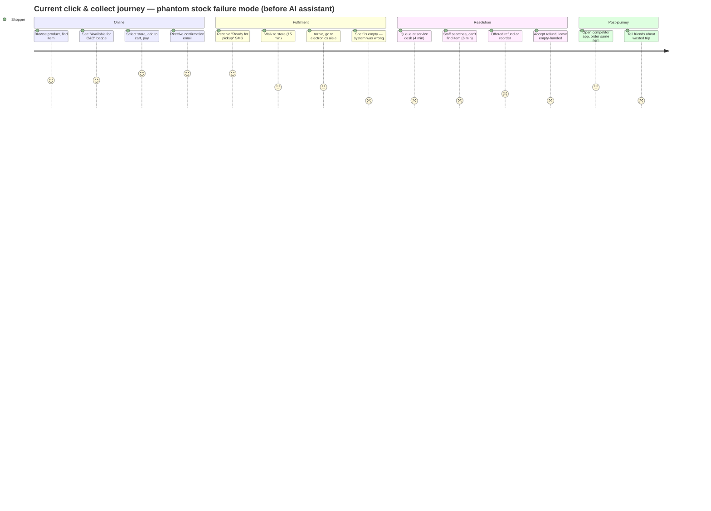

# Journey Map — Click & Collect Phantom Stock (Current State)

**Product:** Meridian Retail Group
**Feature:** AI availability assistant (not yet deployed — current state journey)
**Date:** 2026-06-18
**Shopper persona:** Alex, 32, urban professional, uses click & collect 2–3×/month for household goods

---

## Journey Table

| Step | Action | Emotion | Frustrations (up to 3) | Drop-off point? |
|---|---|---|---|---|
| **1. Product discovery** | Browses meridian.com on mobile, finds a smart lamp they want. Price is right (EUR 49). | 😐 Neutral — routine browsing. Satisfied with the product. | None — discovery is smooth. | — |
| **2. Check availability** | Sees green "Available for Click & Collect" badge on the product page. Taps "Check nearby stores" — their usual store shows "In stock (2+ units)." | 🙂 Positive — convenience: "I can pick it up on the way home." | (1) "2+ units" is vague — could be 2 or 20. (2) No timestamp — is this now or last night? | — |
| **3. Select store & add to cart** | Selects their local Meridian (High Street branch, 1.2 km away). Adds to cart. Chooses click & collect at checkout. Pays by card. | 🙂 Efficient — total time 3 minutes. "Sorted." | (1) Store selector doesn't show *when* stock was last checked. (2) No option to get notified if stock drops before collection. | **Slight:** Could abandon if the nearest store is out of stock, but their store shows availability. |
| **4. Order confirmation** | Receives email: "Your order is confirmed. We'll let you know when it's ready for pickup." | 😊 Positive — confirmation creates expectation of success. "Easy." | (1) "We'll let you know" is passive — no specific time estimate beyond "within 2 hours." | — |
| **5. "Ready for pickup" notification** | 90 minutes later, SMS arrives: "Your order is ready for collection at Meridian High Street. Show this barcode at the pickup desk." | 😊 Positive — the system works. "Great, I'll grab it after work." | (1) No indication of *where* in the store to collect (pickup desk vs shelf-pick). (2) Barcode is the only ID — if phone battery dies, can't collect. | — |
| **6. Travel to store** | Finishes work, walks 15 minutes to the High Street branch. Arrives at 18:10. | 😐 Neutral — routine walk. Slight anticipation of the new lamp. | None — travel is expected. | — |
| **7. Attempt collection — shelf empty** | Goes to the electronics aisle. The shelf space for the smart lamp is **empty**. No staff nearby. Checks the click & collect pickup desk — they don't have it either. | 😠 Frustrated — "It said it was in stock." Energy shifts from anticipation to annoyance. | (1) Shelf is empty — system showed stock but stock wasn't there. (2) No clear process for resolving pickup failures. (3) Staff are busy — have to queue at the service desk. | **⚠️ DROP-OFF POINT #1** — The shopper could leave here if no staff are available and they're short on time. ~30% of phantom stock incidents drop off at this step (no staff interaction → direct cancellation). |
| **8. Staff interaction** | Queues 4 minutes. Explains: "I ordered for click & collect but the shelf is empty." Staff checks handheld terminal — "System says we have 3, but I can't find them. Might be in the back. Let me check." Staff disappears for 6 minutes. | 😠 Frustrated → 😤 Angry — feels like the system has failed. "This has happened before. Why does the website say it's in stock when it isn't?" | (1) Staff can't locate the item either — system is wrong and nobody can override it. (2) 6-minute wait after travelling to store. (3) Staff apologises but has no solution — only refund or reorder for delivery. | **⚠️ DROP-OFF POINT #2** — ~40% of phantom stock incidents drop off here. Shopper accepts refund rather than waiting longer or choosing a substitute. |
| **9. Resolution** | Staff offers three options: (a) full refund (immediate), (b) reorder for home delivery (arrives in 2 days), (c) check other nearby stores (staff calls — the other store also shows stock but can't confirm). Alex takes the refund. Leaves the store empty-handed. | 😞 Disappointed — 90 minutes and EUR 49 spent, nothing to show for it. "I should have just ordered from Amazon." | (1) Refund is immediate but the item is still wanted — now Alex has to start the whole process again on another site. (2) Trust in click & collect is damaged — "I won't use this again for anything time-sensitive." | **✅ DROP-OFF POINT #3 (FINAL)** — The order is cancelled. This is the ~7% cancellation-at-pickup that the problem brief describes. |
| **10. Post-journey** | Opens Amazon on the walk home. The same lamp is EUR 52 (EUR 3 more) with free next-day delivery. Orders it. | 😐 Resigned — solved the immediate need, but the Meridian experience leaves a negative impression. "Next time I'll just check Amazon first." | (1) Switched to a competitor. (2) Tells two friends about the wasted trip — word-of-mouth damage. (3) Will think twice before choosing click & collect at Meridian again. | **🔴 LONG-TERM DROP-OFF** — Channel abandonment. Alex may still shop at Meridian for browse-and-buy, but click & collect adoption drops. Repeat phantom stock incidents cause complete channel abandonment over time. |

---

## Mermaid Journey Diagram



**Score key:**
- **5** — Delighted (confirmation, SMS)
- **4** — Satisfied (discovery, online process)
- **3** — Neutral (travel, arrival)
- **2** — Frustrated (resolution offered but unacceptable)
- **1** — Angry / disappointed (empty shelf, staff can't find, leave empty-handed)

---

## Satisfaction Arc

```
Score
 5 |          📩                   
 4 |  🛍️ 🏷️                      
 3 |        🚶 🚶                  
 2 |                  💬           
 1 |                      😠 😤 😞 😞
   +----------------------------------->
    1   2   3   4   5   6   7   8   9  10
                    Step
```

The arc drops from a peak of 5 (confirmation / SMS) to 1 (empty shelf) in a single step — no gradual decline, no warning. This is the phantom stock problem in one chart: the system builds confidence, then collapses it instantly when reality contradicts the data.

---

## Drop-off Points Summary

| # | Step | Drop-off rate (approx) | Cause | Feature impact |
|---|---|---|---|---|
| **1** | Shelf empty, no staff nearby | ~30% of phantom incidents | Customer leaves without seeking help | Time-sensitive shoppers are lost immediately — AI assistant must prevent this step entirely |
| **2** | Staff can't find item | ~40% of phantom incidents | Staff trust the system, but the system is wrong | Even with staff intervention, resolution is poor — AI assistant must give *them* better data too |
| **3** | Accept refund → leave | ~30% of phantom incidents | No good alternative offered | This is the ~7% overall cancellation rate — AI assistant must reduce false positives at the product page, not at the pickup point |
| **4** | Channel abandonment (long-term) | Cumulative | Repeated phantom stock erodes trust | If phantom stock incidents drop from 7% to <3%, channel trust recovers over time |

---

## Where the AI Assistant Intervenes

The AI availability assistant would intervene at **Step 2** (the product page), replacing the binary "Available for C&C" badge with a confidence estimate:

- **Without AI (current):** "Available for Click & Collect" — binary, no timestamp, no caveat
- **With AI:** "85% likely in stock at High Street" — confidence score + last-checked timestamp + "Check before you go" option

This single intervention pre-empts the entire frustration arc: the shopper's expectation is calibrated *before* they commit to the trip, so even if the stock is wrong, the disappointment is contained. The journey arc becomes:

```
Score (with AI assistant):
 5 |          
 4 |  🛍️ 🏷️                    🎯 (item collected)
 3 |        🔮 (85% — calibrated) 🚶
 2 |                          🔄 (staff check)
 1 |
   +----------------------------------->
```

No sudden collapse from 5→1. The AI confidence estimate sets expectations at 3–4, and the actual outcome (collected vs not) operates within that range. The emotional damage of phantom stock is in the *surprise* — calibrated expectations remove the surprise even if the stock is wrong.
