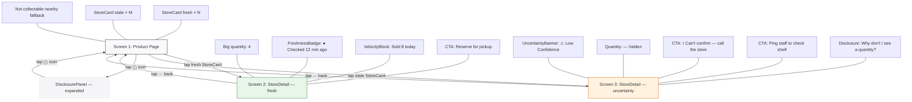

# 06-spec-v2.md — Availability Freshness Indicator (Agent-Ready Handoff)

**Feature:** Phase 0a — Freshness Indicator
**Prototype:** `05-mockup.html` (3 screens, clickable)
**Design tokens:** Named and valued below. Use tokens, not raw values.
**Framework:** Agnostic (CSS custom properties in prototype; adapt to project
framework). Components referenced by name; match the prototype visually.

---

## User Story

**AS A** shopper browsing a product for click & collect pickup
**I WANT** to see when the store stock data was last checked and how fast the
item has been selling
**SO THAT** I can gauge whether the item is likely to still be on the shelf when
I arrive.

---

## Base AC

```
AC1. Product with stock data → show availability indicator per nearby store.
AC2. No store in range → "Not collectable nearby" + home-delivery CTA.
AC3. Store with missing stock data → omit from list. No guessing.
AC4. Tap store → show last-confirmed timestamp + distance.
```

---

## Screen Flow (Mermaid)



---

## Design Tokens

### Color

| Token | Value | Usage |
|-------|-------|-------|
| `--color-ink` | `#1a1a1a` | Primary text, header bg, primary button bg |
| `--color-ink-hover` | `#333333` | Button hover |
| `--color-surface` | `#ffffff` | Container background |
| `--color-page` | `#f2f2f7` | Page-level background |
| `--color-card-bg` | `#f9f9fb` | StoreCard, detail card bg (fresh) |
| `--color-card-border` | `#e5e5ea` | Card border (fresh) |
| `--color-text-body` | `#48484a` | Body copy |
| `--color-text-secondary` | `#6e6e73` | Subtitle, velocity, disclosure text |
| `--color-text-tertiary` | `#8e8e93` | Info icon, disabled hints |
| `--color-text-subtle` | `#aeaeb2` | Dot separators, nav hints |
| `--color-fresh-bg` | `#e8f5e9` | FreshnessBadge bg (fresh) |
| `--color-fresh-text` | `#2e7d32` | FreshnessBadge text (fresh) |
| `--color-fresh-velocity-bg` | `#e8f5e9` | VelocityBlock bg |
| `--color-stale-bg` | `#fff3e0` | FreshnessBadge bg (stale), UncertaintyBanner bg |
| `--color-stale-text` | `#e65100` | FreshnessBadge text (stale), uncertainty heading |
| `--color-stale-text-dark` | `#bf360c` | UncertaintyBanner body |
| `--color-stale-border` | `#ffcc80` | Stale card border, uncertainty banner border |
| `--color-stale-card-bg` | `#fffbf5` | StoreDetail card bg (uncertainty) |
| `--color-disclosure-bg` | `#f5f5f7` | DisclosurePanel bg |
| `--color-disclosure-border` | `#e5e5ea` | DisclosurePanel border |
| `--color-disabled` | `#d1d1d6` | Disabled/placeholder |
| `--color-hero-gradient-start` | `#e8e8ed` | ProductHero gradient start |
| `--color-hero-gradient-end` | `#f5f5f8` | ProductHero gradient end |

### Typography

| Token | Size | Weight | Line-height | Usage |
|-------|------|--------|-------------|-------|
| `--text-price` | 22px | 700 | 1.3 | Product price |
| `--text-heading-lg` | 20px | 700 | 1.3 | Product name |
| `--text-heading-md` | 17px | 700 | 1.3 | Store name in detail header |
| `--text-heading-sm` | 16px | 700 | 1.3 | Section titles, uncertainty heading |
| `--text-body-lg` | 15px | 600 | 1.4 | Store name in card |
| `--text-body` | 14px | 400/600 | 1.4 | Body, quantity labels, CTAs |
| `--text-body-sm` | 13px | 400 | 1.4 | Store distance, meta rows, disclosure |
| `--text-caption` | 12px | 400/600 | 1.5 | Velocity, disclosure body, nav hints |
| `--text-label-sm` | 12px | 600 | 1.3 | FreshnessBadge |
| `--text-label-xs` | 11px | 700 | 1.3 | Low Confidence tag (uppercase, 0.5px letter-spacing) |
| `--text-qty-xl` | 36px | 800 | 1.1 | Big quantity in detail view |

Font stack: `-apple-system, BlinkMacSystemFont, "Segoe UI", Roboto, Helvetica,
Arial, sans-serif`

### Spacing

| Token | Value | Usage |
|-------|-------|-------|
| `--space-xs` | 4px | Badge icon-to-text gap |
| `--space-sm` | 8px | Step dots gap, inline gaps |
| `--space-md` | 12px | Header gap, CTA row gap |
| `--space-lg` | 16px | Card padding, section padding, card margin |
| `--space-xl` | 20px | Section padding top/bottom |
| `--space-2xl` | 24px | ProductHero padding |

### Radius

| Token | Value | Usage |
|-------|-------|-------|
| `--radius-sm` | 8px | Active step dot |
| `--radius-md` | 12px | Buttons, velocity block, disclosure panel |
| `--radius-lg` | 14px | StoreCards |
| `--radius-xl` | 16px | Product image, detail cards, uncertainty banner |
| `--radius-pill` | 20px | FreshnessBadge |
| `--radius-phone` | 36px | Phone mockup container |

---

## Components

### Component 1: StoreCard

Tappable row summarising one store's availability. Appears in a vertical list
below "Click & Collect" section heading on the product page.

**AC linkage:** Base AC1, Base AC4, AI-AC1, AI-AC2, AI-AC6

#### Variants

| Variant | Trigger | Key visual differences |
|---------|---------|----------------------|
| `fresh` | `now() - lastSyncTimestamp ≤ STALENESS_THRESHOLD` (30 min) | Border: `--color-card-border`. Bg: `--color-card-bg`. FreshnessBadge: `fresh` variant. Shows quantity + "Checked X min ago" + velocity. |
| `stale` | `now() - lastSyncTimestamp > STALENESS_THRESHOLD` (30 min) | Border: `--color-stale-border`. Bg: `--color-stale-card-bg` (#fffbf5). FreshnessBadge: `stale` variant. Quantity with caveat: "X units — may have changed". "Tap for details →" in `--color-stale-text`, weight 600. |

#### States

| State | Condition | Behaviour |
|-------|-----------|-----------|
| `default` | Data present | Card visible, tappable |
| `hover` | Pointer over | Bg shifts to `#f0f0f5` |
| `active` | Tap/click | Scale 0.985, navigate to StoreDetail |
| `empty` | No stores in range | Card list replaced by "Not collectable nearby" + home-delivery CTA |
| `omitted` | Store has null/missing/timeout data | Card not rendered (Base AC3) |

#### Token references

- Store name: `--text-body-lg` (15px, 600), `--color-ink`
- Distance: `--text-body-sm` (13px, 400), `--color-text-secondary`
- Quantity: `--text-body` (14px, 700), `--color-ink` (fresh) / `--color-stale-text` (stale caveat)
- Separator dots: `--color-text-subtle` (#aeaeb2)
- Padding: `--space-lg` (16px)
- Radius: `--radius-lg` (14px)
- Margin-bottom: 10px

---

### Component 2: StoreDetail

Expanded view after tapping a StoreCard. Full availability for one store.

**AC linkage:** Base AC4, AI-AC1, AI-AC2, AI-AC3, AI-AC6

#### Variants

| Variant | Trigger | Key visuals |
|---------|---------|-------------|
| `fresh-detail` | Tapped fresh StoreCard | Big quantity (`--text-qty-xl`, `--color-ink`), FreshnessBadge (fresh), detail rows, VelocityBlock, "Reserve for pickup" CTA |
| `uncertainty` | Tapped stale StoreCard | Quantity "—" (`--color-stale-text`), UncertaintyBanner, Low Confidence tag, "Can't confirm — call the store" CTA, no VelocityBlock |

#### States

| State | Condition | Behaviour |
|-------|-----------|-----------|
| `fresh` | sync age ≤ 30 min | Quantity + velocity + reserve CTA |
| `uncertainty` | sync age > 30 min | UncertaintyBanner + fallback CTAs |
| `back-navigation` | ← tapped | Return to Screen 1 |

#### Token references

- Detail header bg: `--color-ink` (#1a1a1a), text: `--color-surface` (#fff)
- Big quantity: `--text-qty-xl` (36px, 800), `--color-ink` (fresh) / `--color-stale-text` (uncertainty)
- Detail row label: `--text-body` (14px), `--color-text-secondary`
- Detail row value: `--text-body` (14px, 600), `--color-ink`
- Divider: 1px `--color-card-border`
- Card padding: `--space-xl` (20px)
- Card radius: `--radius-xl` (16px)

---

### Sub-component: FreshnessBadge

Inline pill indicating data age.

| Variant | Bg token | Text token | Icon | Label |
|---------|----------|------------|------|-------|
| `fresh` | `--color-fresh-bg` | `--color-fresh-text` | ● | "Fresh data" or "Checked X min ago" |
| `stale` | `--color-stale-bg` | `--color-stale-text` | ⚠ | "Stale data" or "Last checked >30 min ago" |

Typography: `--text-label-sm` (12px, 600). Radius: `--radius-pill` (20px).
Padding: 3px 10px.

### Sub-component: UncertaintyBanner

Full-width amber banner. Only in `uncertainty` variant of StoreDetail.

- Bg: `--color-stale-bg`. Border: 1.5px `--color-stale-border`
- Icon: ⚠️ (36px). Low Confidence tag: `--text-label-xs` (11px, 700, uppercase, 0.5px letter-spacing), `--color-stale-text`
- Heading: `--text-heading-sm` (16px, 700), `--color-stale-text`
- Body: `--text-body-sm` (13px, 400), `--color-stale-text-dark`
- Margin: `--space-lg` (16px). Radius: `--radius-xl` (16px). Padding: `--space-lg` (16px)

### Sub-component: DisclosurePanel

Toggleable info panel. ⓘ icon toggles `collapsed` ↔ `expanded`.

- **Collapsed:** `display: none`
- **Expanded:** `display: block`, below "Click & Collect" section title
- Bg: `--color-disclosure-bg`. Border: 1px `--color-disclosure-border`
- Text: `--text-caption` (12px, 400), `--color-text-secondary`, line-height 1.5
- Padding: 14px 16px. Radius: `--radius-md` (12px)
- **Visual gate:** Verbatim text from AI-AC4. No deviation permitted.

### Sub-component: VelocityBlock

Sell-through explainer. Only in `fresh-detail` variant of StoreDetail.

- Bg: `--color-fresh-velocity-bg`. Text: `--text-caption` (12px), `--color-fresh-text`
- Icon: 📊 (20px). Radius: `--radius-md` (12px). Padding: 14px 16px

---

## Negative AC Carried Forward (AI-AC6)

> The page must NOT show: "In stock", "In Stock", "Available", "Available for
> Click & Collect", green checkmark, or any binary positive-affirmation pattern.

| Forbidden | Enforced in | How |
|-----------|------------|-----|
| "In stock" / "In Stock" | All components, all states | No label uses it. Status = quantity + timestamp |
| "Available" / "Available for Click & Collect" | Section titles, CTAs | Section = "Click & Collect". CTA = "Reserve for pickup" |
| Green checkmark (✅ ✔ 🟢) | FreshnessBadge | Fresh = ● dot + "Fresh data", no checkmark |
| Any new guarantee-like string | CI pipeline | grep rendered DOM before deploy |

---

## Asset & Data References

| Asset | Reference | Resolvable? |
|-------|-----------|-------------|
| Product image | PIM CDN: `https://cdn.meridian.com/pim/<sku>/hero-2x.jpg` | ✅ |
| ⓘ icon | Design system: `icons/info-circle.svg` (18px) | ✅ |
| ← back arrow | Design system: `icons/chevron-left.svg` (22px) | ✅ |
| ⚠️ warning | Design system: `icons/alert-triangle.svg` (36px) | ✅ |
| 📞 phone | Design system: `icons/phone.svg` (16px, inline in button) | ✅ |
| 📊 chart | Design system: `icons/trending-up.svg` (20px) | ✅ |
| Store availability API | `GET /api/stores/{storeId}/availability/{sku}` → `{ storeId, sku, qtyOnShelf, sellThroughToday, lastSyncTimestamp, distance }` | ✅ |
| SAP sync timestamp | Field `lastSyncTimestamp` (ISO 8601, UTC) in API response | ✅ |
| Staleness threshold | Remote-config: `STALENESS_THRESHOLD_MINUTES` (default 30) | ✅ |

---

## Definition of Handoff Done — Self-Check

| # | Criterion | Status | Evidence |
|---|-----------|--------|----------|
| 1 | User story + base AC present | ✅ | §1 + §2 |
| 2 | ≥ 3 AI-AC refined to 6-slot template | ✅ | AI-AC1, AI-AC2, AI-AC4 refined in `04-ai-ac-v2.md` |
| 3 | CONTEXT.md covers 6 slots | ✅ | `06-context-v2.md`: feature, audience, environment, constraints, out-of-scope, artifacts |
| 4 | SPEC.md ≥ 2 components + states + token refs | ✅ | StoreCard (2 variants, 5 states) + StoreDetail (2 variants, 3 states) + 4 sub-components; all reference named tokens |
| 5 | Asset/data refs explicit & resolvable | ✅ | 9 references with paths/endpoints |
| 6 | Negative AC carried into SPEC.md | ✅ | AI-AC6 in §6 with enforcement table |
